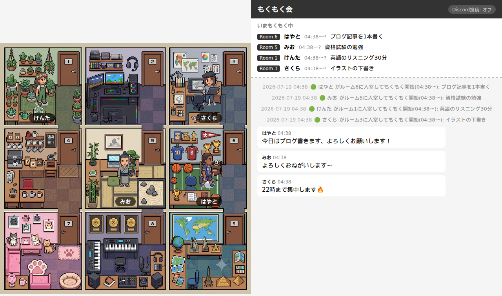

# もくもく会チャット

もくもく会（それぞれが黙々と自分の作業をする集まり）を、オンラインでゆるくつながりながらやるためのアプリです。



ブラウザで開くと9つの部屋があるピクセルアートの建物が表示され、「入室」すると自分のキャラクターがどこかの部屋に入ります。誰が・いつまで・何をもくもくしているかが一覧で見え、ひとことチャットもできます。退室すると「今日なにをどれだけやったか」の記録が1行で出てくるので、日報などにコピペできます。

- アカウント登録は不要。名前を入れるだけ
- 閲覧は誰でも自由。書き込みは部屋共通の「合言葉」で保護できます（任意）
- チャットをDiscordのチャンネルに流すこともできます（任意）
- 画面が3×3の「ワールドマップ」になり、周りのマスに**別のもくもく会**・**YouTubeルーム**・**時計**・**カレンダー**・**ブラウザ**を置けます（任意）

---

## 参加する人向け：使い方

サーバーは主催者が立てています。**主催者からURL（と合言葉）を教えてもらってから**始めてください。

1. 教えてもらったURLをブラウザで開く
2. 画面下のフォームに **名前** と **もくもくする内容**（例:「読書」「資料づくり」）を入力する
   - 開始時刻は自動で入ります。終了予定は任意です
3. **「入室」ボタン** を押す
   - 合言葉を聞かれたら、主催者から教えてもらったものを入力します（最初の1回だけ。以降はこのブラウザが覚えます）
4. どこかの部屋に自分のキャラクターが現れたら、もくもく開始!
   - チャット欄が使えるようになります。Enterで送信、Shift+Enterで改行です
   - 内容や終了予定を変えたくなったら「編集」ボタンで変更できます
5. 終わったら **「退室」ボタン** を押す
   - 「📋 今日の記録」（日付・時間・実績分数・やったこと）が表示されるので、「コピー」して日報などに貼れます

### ちょっとした補足

- 部屋は9つです。満室のときは空きが出るまで待ってください
- 主催者がマップに何かを置いている場合、画面が3×3の「ワールドマップ」になります。真ん中が自分たちの部屋で、周りのマスには別のもくもく会やYouTubeルーム、時計やカレンダー、任意のページを埋め込んだブラウザが並びます。マスをクリックするとそのマスが大きく表示され、真ん中をクリックすればいつもの表示に戻ります
  - **つながった相手の部屋**では、向こうの参加者とチャットが自分の画面に混ざって表示されます。このとき**自分の発言も相手の画面に出ます**
  - **YouTubeルーム**は、主催者が選んだ動画を置いたマスです。▶を押すと再生が始まります（押すまでは何も再生されません）。再生・停止・音量は自分の画面だけの操作で、他の人には影響しません。再生したまま別のマスを見に行っても鳴り続けるので、作業用BGMとしても使えます。止めるときはマップに出る「⏹」を押してください
  - **時計**は掛け時計のマスです。出ているのは**あなたの端末の時刻**なので、海外から参加している人には、その人のところの時刻が見えます
  - **カレンダー**は月めくりカレンダーのマスです。出ているのは**あなたの端末の日付**なので、海外から参加している人には、その人のところの日付が見えます
  - **ブラウザ**は指定したURLのページをそのまま埋め込むマスです。OBSの「ブラウザ」ソースに近いイメージで、置いた瞬間から参加者全員の画面でそのページが自動的に読み込まれます
- 「本人かどうか」はブラウザ単位で覚えています。同じブラウザで開き直せば続きから使えますが、別の端末からは別人扱いになります
- 名前は途中で変えても大丈夫です（変更したことがチャットに流れます）

---

## 主催者向け：サーバーの立て方

参加者にHTTPSの使い捨てURLでアクセスしてもらう仕組みを、AWS EC2上で自動化しています。イベントのたびにインスタンスを起動 → URLを取得 → 終わったら破棄、という流れをスクリプト2本で行います。**AWSアカウントでの一度だけの準備**が必要ですが、それさえ済ませれば毎回はコマンド2つで完結します。

### 必要なもの

- AWSアカウント（`t3.micro`は無料枠の対象になる場合が多いですが、課金の可能性があることは理解した上で進めてください）
- Python 3.x が入ったパソコン（Mac / Linux / Windows(WSL)）※アプリ本体はAWS上で動くので、参加者を招く用途でこのパソコン自体を公開する必要はありません
- git

### 初回だけの準備

一度やれば、以降は「イベントごと」の2コマンドだけで済みます。

```bash
# 1. このリポジトリを取得
git clone https://github.com/haya256/mokumoku-suru-tameno-nanika.git
cd mokumoku-suru-tameno-nanika

# 2. 起動スクリプトが使うライブラリを入れる
python3 -m venv venv
venv/bin/pip install boto3 awscli
```

#### AWSコンソールでの設定（一度だけ）

1. **IAMロール（兼インスタンスプロフィール）を作る** — 起動したインスタンスがSSM経由で操作できるようにするためのものです
   - IAM → ロール → 「ロールを作成」→ 信頼するエンティティ: **AWSのサービス** → ユースケース: **EC2**
   - 許可ポリシーで `AmazonSSMManagedInstanceCore` を検索してチェック
   - ロール名は `mokumoku-ssm-role` など分かりやすい名前に。作成すると同じ名前のインスタンスプロフィールも自動的にできます
2. **セキュリティグループを作る** — インバウンドルールは追加不要です。cloudflaredもSSM Agentもインスタンス側から外向きに接続するだけなので、ポートを開ける必要がありません
   - EC2 → セキュリティグループ → 「セキュリティグループを作成」→ VPCは**デフォルトVPC**を選択
   - インバウンドルールは何も追加しない（アウトバウンドは初期状態の「すべて許可」のままでOK）
3. **操作用のIAMユーザーを作る** — このパソコンから起動・終了スクリプトを実行するための認証情報です
   - IAM → ユーザー → 「ユーザーを作成」→ アクセスキーを発行
   - 以下をインラインポリシーとして貼り付けます（`<ロールのARN>` は手順1で作ったロールのARNに置き換え）

     ```json
     {
       "Version": "2012-10-17",
       "Statement": [
         {
           "Effect": "Allow",
           "Action": [
             "ec2:RunInstances",
             "ec2:TerminateInstances",
             "ec2:CreateTags",
             "ec2:Describe*",
             "ssm:SendCommand",
             "ssm:GetCommandInvocation",
             "ssm:DescribeInstanceInformation"
           ],
           "Resource": "*"
         },
         {
           "Effect": "Allow",
           "Action": "iam:PassRole",
           "Resource": "<ロールのARN>"
         }
       ]
     }
     ```

   - 発行されたアクセスキーID・シークレットアクセスキーを控えておく
4. **ローカルにAWS認証情報を設定**

   ```bash
   venv/bin/aws configure
   # アクセスキーID、シークレットアクセスキー、デフォルトリージョン(ap-northeast-1)を入力
   ```

5. **`config/settings.json` を作って `deploy` セクションを埋める**

   ```bash
   cp config/settings.sample.json config/settings.json
   ```

   `ami_id` は最新のUbuntuイメージIDを次のコマンドで調べられます（実行するたびに最新版が得られます）。

   ```bash
   venv/bin/aws ssm get-parameters \
     --names /aws/service/canonical/ubuntu/server/24.04/stable/current/amd64/hvm/ebs-gp3/ami-id \
     --region ap-northeast-1 --query 'Parameters[0].Value' --output text
   ```

   `security_group_id` / `subnet_id` は手順2で作ったセキュリティグループのID、デフォルトVPC内の適当なサブネットのID（AWSコンソールの「サブネット」一覧で確認できます）。`iam_instance_profile_name` は手順1で作ったロール名です。

   ```json
   {
     "deploy": {
       "region": "ap-northeast-1",
       "instance_type": "t3.micro",
       "ami_id": "ami-xxxxxxxxxxxxxxxxx",
       "security_group_id": "sg-xxxxxxxxxxxxxxxxx",
       "subnet_id": "subnet-xxxxxxxxxxxxxxxxx",
       "iam_instance_profile_name": "mokumoku-ssm-role",
       "auto_terminate_hours": 6
     }
   }
   ```

6. **合言葉を設定する**（推奨。詳しくは後述の「合言葉を設定する」を参照）

   ```bash
   mkdir -p config
   echo "好きな合言葉" > config/合言葉.txt
   ```

これで準備は完了です。

### イベントごと：起動と終了

もくもく会を開くたびに、この2コマンドだけです。

```bash
# イベント開始時: インスタンスを起動してURLを取得(数分かかります)
venv/bin/python deploy/start_event.py
```

`参加者に共有するURL: https://xxxxx.trycloudflare.com` のように表示されたら、そのURLを参加者に伝えます。

```bash
# イベント終了時: インスタンスを完全に破棄(データも消えます)
venv/bin/python deploy/stop_event.py
```

### 知っておいてほしいこと

- **データも環境もイベントごとに使い捨てです。** `stop_event.py` でインスタンスごと破棄され、チャット履歴や入室記録は一切残りません
- URLは起動するたびに変わります。もくもく会のたびに新しいURLを伝えてください
- `stop_event.py` を実行し忘れた場合に備えて、インスタンス内で**6時間後に自動シャットダウン**する保険が入っています。ただし課金を確実に止めるには、シャットダウン待ちにせず `stop_event.py` で明示的に終了させることを推奨します
- インスタンス起動時に渡す情報(合言葉やDiscord Webhook URLを含む)は、同じAWSアカウント内で権限を持つ人なら閲覧できる状態になります。SSHでログインされるのと同程度の信頼範囲だと考えてください
- AWSを使わずローカルで動作確認だけしたい場合は `venv/bin/pip install -r requirements.txt && venv/bin/python server.py` で `http://localhost:5000` を開けます
- 開発時のAPIテストは `venv/bin/pip install -r requirements-dev.txt && venv/bin/python -m pytest tests` で実行できます(外部通信はモックされ、`config/` の本物の設定には触れません)

### 困ったとき（デプロイ関連）

URLが出ずタイムアウトする場合は、SSM経由でインスタンスに入ってログを確認できます。

```bash
venv/bin/aws ssm start-session --target <start_event.pyが表示したインスタンスID>
cat /var/log/mokumoku_userdata.log   # セットアップ全体のログ
cat /var/log/mokumoku_server.log     # server.py自体のログ
cat /var/log/tunnel_raw.log          # cloudflaredのログ
```

インスタンスが残っていないか不安なときは、AWSコンソールのEC2画面か、以下のコマンドで確認できます。

```bash
venv/bin/aws ec2 describe-instances --filters "Name=tag:Name,Values=mokumoku-event" "Name=instance-state-name,Values=running"
```

### 代替手段：VPS + Cloudflare Tunnel（手動・AWSを使いたくない場合）

AWSアカウントを作りたくない場合や、すでに自分のVPSを持っていて使い慣れている場合は、こちらの手動デプロイもできます。EC2自動化と違い、`server.py` と `cloudflared` の起動・停止は自分で行う必要があります。

- Python 3.x が入ったVPS（レンタルサーバー）（Mac / Linux / Windows(WSL)でも試せますが、**参加者を集めて実際に公開するならVPSを推奨**します。理由は後述）

```bash
# 1. このリポジトリを取得
git clone https://github.com/haya256/mokumoku-suru-tameno-nanika.git
cd mokumoku-suru-tameno-nanika

# 2. Python の仮想環境を作って必要なライブラリを入れる（初回だけ）
python3 -m venv venv
venv/bin/pip install -r requirements.txt

# 3. サーバーを起動
venv/bin/python server.py
```

起動したら、ブラウザで http://localhost:5000 を開いて動作を確認してください。

参加者にインターネット越しにアクセスしてもらう方法として、Cloudflare の「クイックトンネル」が使えます。アカウント登録なし・無料で、サーバーに一時的なURL（HTTPS付き）でアクセスできるようになります。

> ⚠️ **自分の使っているパソコンで直接動かすのは非推奨です。** 万一このアプリに脆弱性があった場合、パソコンそのものがインターネットに直接晒される形になり、被害が他の作業データやブラウザのログイン状態などパソコン全体に及ぶ可能性があります。**参加者を集めて実際に使うときは、VPS（レンタルサーバー）上で動かしてください。** 何なら侵害されてもそのVPSだけの被害で済みます。

#### VPS上で動かす場合

VPSにSSHでログインした状態で実行します。`server.py`（アプリ本体）と `cloudflared`（公開用トンネル）の2つを起動しっぱなしにする必要があります。やり方は2パターンあるので、好みで選んでください。

**パターンA: 2つのSSHセッションを開く（シンプル）**

上の `venv/bin/python server.py` を実行したセッションをそのまま残しておき、**別のSSHセッションをもう1つ開いて**、以下を実行します。SSHセッションを閉じると両方止まるので、動作確認だけしたい・短時間だけ使う場合向けです。

```bash
# 1. cloudflaredをインストール（初回だけ、Ubuntu/Debian系）
curl -fsSL https://github.com/cloudflare/cloudflared/releases/latest/download/cloudflared-linux-amd64.deb -o /tmp/cloudflared.deb
sudo dpkg -i /tmp/cloudflared.deb

# 2. トンネルを開始
cloudflared tunnel --url http://localhost:5000
```

**パターンB: nohup でバックグラウンド化（SSHセッション1つで完結、おすすめ）**

`server.py` を `nohup` でバックグラウンドに回すと、SSHセッションを閉じてもサーバーが動き続けます。同じセッションのまま続けて `cloudflared` も起動できます。

```bash
# 1. サーバーをバックグラウンドで起動
nohup venv/bin/python server.py > server.log 2>&1 &
disown

# 2. 動いているか確認（HTMLが返ってくればOK）
curl http://localhost:5000

# 3. cloudflaredをインストール（初回だけ、Ubuntu/Debian系）
curl -fsSL https://github.com/cloudflare/cloudflared/releases/latest/download/cloudflared-linux-amd64.deb -o /tmp/cloudflared.deb
sudo dpkg -i /tmp/cloudflared.deb

# 4. トンネルを開始
cloudflared tunnel --url http://localhost:5000
```

- ログを見たいときは `tail -f server.log`
- サーバーだけ止めたいときは `pkill -f server.py`

少し待つと `https://ほにゃらら.trycloudflare.com` のようなURLが表示されます。これをそのまま参加者に伝えます（サーバーは`127.0.0.1`でしか待ち受けないので、ファイアウォールを開ける必要はありません）。

終わったら、サーバーとトンネル両方のプロセスを止めます。

```bash
ps aux | grep -E "server.py|cloudflared"
kill <server.pyのPID> <cloudflaredのPID>
```

知っておいてほしいこと：

- URLは実行するたびに変わります。もくもく会のたびに新しいURLを伝えてください
- インターネット上の誰でもURLさえ知ればアクセスできる状態になります。**後述の「合言葉を設定する」を必ず設定してから**URLを共有するのがおすすめです
- `python3 -m venv venv` で「ensurepipが無い」というエラーが出た場合は、`sudo apt install python3.12-venv` を実行してから作り直してください
- **データはサーバーを止めると消えます**（メモリ上にだけ保存しています）。1回のもくもく会ごとに使い切るイメージです
- 止めるときはターミナルで `Ctrl+C` です。反応しない場合は `ps aux | grep server.py` でプロセスを探し、`kill <PID>` で止めてください

---

## 合言葉を設定する（おすすめ）

そのままでも使えますが、URLを知っていれば誰でも書き込めてしまいます。**ファイルを1つ置くだけ**で、書き込み・入室に合言葉が必要になります（閲覧は誰でも可能なまま）。

```bash
mkdir -p config
echo "好きな合言葉" > config/合言葉.txt
```

- サーバーの再起動は不要です。置いた瞬間から合言葉がかかります
- 合言葉を変えたいときはファイルを書き換えるだけ、外したいときはファイルを消すだけです
- 参加者には口頭やDiscordなどで合言葉を伝えてください

### もっと細かく設定したい場合（config/settings.json）

セキュリティの動作は `config/settings.json` で変えられます（このファイルが無ければ既定値で動くので、作るのは変えたいときだけでOKです）。

サンプルをコピーして作ります。

```bash
cp config/settings.sample.json config/settings.json
```

中身はこうなっています。

```json
{
  "security": {
    "mode": "very_easy",
    "passphrase_file": "config/合言葉.txt"
  },
  "appearance": {
    "title": "もくもく会",
    "room_image": "assets/room-image-1.webp"
  }
}
```

| 設定 | 意味 |
| --- | --- |
| `security.mode: "very_easy"` | 閲覧は自由、書き込み・入室・退室に合言葉が必要（既定）。ただし合言葉ファイルが無い間は合言葉なしで通ります |
| `security.mode: "none"` | 完全に認証なし。合言葉ファイルがあっても聞かれません |
| `security.passphrase_file` | 合言葉を書いたファイルの場所（既定: `config/合言葉.txt`） |
| `security.admin_passphrase_file` | 管理者合言葉を書いたファイルの場所（既定: `config/管理者合言葉.txt`）。詳しくは次の「管理者合言葉を設定する」を参照 |
| `appearance.title` | 画面上部とブラウザのタブに出るタイトル（既定: `もくもく会`、40文字まで）。起動時はこの値で始まります |
| `appearance.room_image` | 画面左に表示する部屋の画像（既定: `assets/room-image-1.webp`）。`assets/room-image-2.webp` に変えたり、自分で用意した画像のパスを指定できます |
| `world.areas` | マップに置いたエリア（他のもくもくルーム、YouTubeルーム）の一覧。手で書くものではなく、Web画面の「ワールド設定」から操作すると自動的に書き込まれます。詳しくは後述の「ワールドマップ」を参照。※古いバージョンが書いた `world.peers` があれば、読み込み時に自動で `world.areas` に移行されます |
| `world.fork_poll_interval_sec` | Redisバックエンドの派生版(fork型ピア)を巡回する間隔（秒、既定: 60）。短くしすぎると相手のRedis・サーバー利用量を圧迫するので注意。詳しくは後述の「ワールドマップ」を参照 |

設定の変更はサーバー再起動なしで反映されます。なお `config/` ディレクトリはgit管理外なので、合言葉をうっかり公開してしまう心配はありません。

> タイトルと部屋画像はこのファイルを直接編集する以外に、管理者合言葉でログインするとWeb画面からも切り替えられます。詳しくは次の「管理者合言葉を設定する」を参照してください。

---

## 管理者合言葉を設定する（任意）

特定の人だけ他の参加者を強制退出させたり、部屋画像を変更したり、他のもくもくルームとつないだりできるようにできます。

```bash
mkdir -p config
echo "好きな管理者合言葉" > config/管理者合言葉.txt
```

- 入室・チャットなどでいつもの合言葉を聞かれたとき、**代わりにこの管理者合言葉を入力**すると、通常の書き込み権限に加えて「強制退出」「ルームの設定（タイトル・状態・部屋画像）」「他のルームとの接続」権限も得られます（専用のログイン画面はありません）
- 管理者権限を持つと、「いまもくもく中」の一覧に他の人の行だけ「強制退出」ボタンが表示されます
- 管理者権限を持つと、部屋画像の右上に「ルームの設定」ボタンが表示されます。押すとパネルが開き、次の3つを変更できます
  - **タイトル**: 画面上部とブラウザのタブに出る名前。入力して「変更」を押すと全員の画面に反映されます（`config/settings.json` の `appearance.title` が書き換わり、次回起動後も同じタイトルのままです）
  - **状態**: 通常／準備中／Closed。準備中・Closedにすると部屋に電気を消したような演出がかかります
  - **部屋画像**: `assets/room-image-*.webp` のサムネイル一覧から、クリックした画像に切り替わります（`appearance.room_image` が書き換わり、次回起動後も同じ画像のままです）
  - 切り替えた本人にはすぐ反映されます。他の参加者には、全員が同時に画像を再取得してアクセスが集中しないよう、最大10秒程度のランダムな遅延を挟んでから自動的に反映されます
- `security.mode: "none"`（合言葉なしモード）のときはこの機能は使えません。合言葉自体を誰も入力しないためです
- ファイルを消せば管理者機能自体がオフになります（サーバー再起動不要）
- 参加者に配る合言葉とは別物にしてください。同じにすると全員が強制退出・部屋画像の変更・ワールドマップの操作をできてしまいます

---

## ワールドマップ：周りのマスに何かを置く（任意）

つないだり置いたりすると、画面が3×3の「ワールドマップ」になります。真ん中が自分たちの部屋で、**周囲8マスに好きなものを置けます**。マスをクリックするとフルサイズで開きます。

置けるものは今のところ5種類です。

| 種別 | 内容 |
| --- | --- |
| **もくもくルーム** | 別の場所で開かれているもくもく会。相手の部屋の様子・在室者・チャットが自分の画面に流れ込みます |
| **YouTubeルーム** | 管理者が選んだ動画1本を置いたマス。参加者がマスの中で再生を操作できます |
| **時計** | アナログの掛け時計。見ている人の端末の時刻を指します |
| **カレンダー** | 月めくりカレンダー。見ている人の端末の日付を指し、拡大すると月間カレンダーになります |
| **ブラウザ** | 指定したURLのページをそのままiframeで表示します。埋め込みを許可していないサイトは表示できません |

置き方はどれも共通です。

1. 管理者合言葉でログインした状態にする（入室時などに管理者合言葉を入力する）
2. 部屋画像の右上に出る **「ワールド設定」** ボタンを押す
3. 種別を選んで、必要な項目を入れる（もくもくルーム・YouTubeルーム・ブラウザはURL、時計とカレンダーは表示名だけ。表示名はどれも任意）

片付けるのも同じパネルからできます。**設置・撤去ともサーバーの再起動は不要**で、参加者の画面もページを開き直さずに追随します。マスは全部で8つまでで、種別をまたいで共有します（もくもくルーム2つ＋YouTubeルーム2つ＋時計1つ＋カレンダー1つ＋ブラウザ2つ、といった配分は自由です）。

### もくもくルームをつなぐ

相手ルームのURL（`https://xxxxx.trycloudflare.com` のような形）を入れてください。つないだ相手について、次のものが自分の画面に出るようになります。

- 部屋の画像と、そこでもくもくしている人のキャラクター・名前
- 「もくもくフレンズ」一覧（相手ルームの行は色の違うバッジで区別されます）
- チャット（発信元のルーム名のタグが付いて、自分たちの発言と時系列で混ざります）

種別の中の「通常/Redis版」は基本「通常」のままで構いません。相手がこのリポジトリ系統（Flask）ではなく、[elm200版](https://github.com/elm200/mokumoku-suru-tameno-nanika)のようなFastAPI+Redisの派生版で動いている場合だけ「Redis版」を選びます。この読み替えは向こうの現行のAPI形状に合わせた個別対応なので、向こうの実装が変わると通知なく壊れる可能性があります。またアクセス1回あたり相手のRedisコマンドを複数消費する作りのため、通常型より巡回間隔を空けています（既定60秒、`world.fork_poll_interval_sec` で調整可）。もくもく会は限られた時間だけ動かす運用が前提なのでこの間隔でも実用上問題ありませんが、長時間つなぎっぱなしにする場合は間隔を大きくすることを検討してください。

#### 知っておいてほしいこと

- **接続は片方向です。** AがBのURLを登録しても、B側には何も起きません。お互いの部屋が見えるようにするには、**両方の主催者がそれぞれ相手のURLを登録**してください
- **相手がこちらを登録していれば、こちらのチャットは相手ルームの画面にも流れます。** もともと閲覧は誰でも自由（合言葉がかかるのは書き込みだけ）なので機密性が下がるわけではありませんが、「読もうと思えば読める」から「相手の画面に出る」に変わります
- 相手の情報を取りに行くのは**自分のサーバー**です。参加者のブラウザが相手サーバーに直接アクセスすることはありませんが、その代わり**自分のサーバーのIPアドレスは相手に見えます**
- 相手が落ちている・URLが失効している場合、そのマスは「接続できません」とグレー表示になります。こちら側の入退室やチャットには影響しません
- 「Redis版」でつないだ相手は、通常型（5秒間隔）と違って `world.fork_poll_interval_sec`（既定60秒）でしか状態を取りに行かないため、在室者やチャットの反映が最大その秒数だけ遅れます

### YouTubeルームを置く

種別で「YouTubeルーム」を選び、動画のURL（`https://youtu.be/...`、`https://www.youtube.com/watch?v=...`、ショート動画のURLなど）を入れてください。表示名を空にしておくと、動画のタイトルが自動で入ります。置いたあとも、一覧の行にある「別の動画URLに差し替え」から動画だけを入れ替えられます（マスの位置は変わりません）。

- **勝手には再生されません。** マスにはサムネイルと▶だけが出ていて、参加者が▶を押して初めてプレイヤーが現れます
- **再生は各自バラバラです。** 一時停止・シーク・音量はその人の画面だけの操作で、他の参加者には伝わりません（みんなで同じ場面を見る「同時視聴」ではありません）
- 小さいマスのままでも再生できます。マス右上の「⤢」を押すとフルサイズになり、**再生は途切れません**
- 再生したまま別のマスを見に行っても鳴り続けます。マップに出る停止バー（`▶ 動画名` ＋「そのマスへ」「⏹」）から、どこを見ていても戻る・止めることができます
- 同時に鳴るのは1本だけです。別のYouTubeルームで▶を押すと、前の再生は止まります
- サムネイルを取りに行くのは**自分のサーバー**です。参加者のブラウザがYouTubeと通信するのは▶を押したあとだけになります
- スマートフォンなど画面が狭い場合は、▶を押すと同時にマスが拡大します（小さいままだとYouTubeの操作ボタンが隠れてしまうため）
- 限定公開・削除済みなどでサムネイルが取れない動画は、置こうとした時点で弾かれます
- 埋め込みが許可されていない動画は、置く時点で警告が出ます（置くこと自体はできますが、参加者の画面では再生できません）

### 時計を置く

種別で「時計」を選び、**「置く」**を押すだけです。URLは要りません。表示名を空にしておくと「時計」になります（「いまの時刻」「壁掛け時計」など、好きな名前を付けられます）。

- **出ているのは見ている人の端末の時刻です。** サーバーの時刻でも、主催者が選んだタイムゾーンでもありません。海外から参加している人の画面には、その人のところの時刻が出ます
- 秒針は1秒ごとにチクタク進みます。小さいマスでは目盛りだけ、マスを拡大すると文字盤に数字も出ます
- 描いているのは**参加者のブラウザだけ**です。時刻のためにサーバーへ問い合わせることはなく、置いたあとサーバーは何もしません
- 端末の時計がずれていると、そのぶんずれて見えます（時計を合わせてもらってください）
- OSの「視差効果を減らす」「アニメーションを減らす」設定が入っている端末では、秒針を出しません（時針と分針は動きます）

### カレンダーを置く

種別で「カレンダー」を選び、**「置く」**を押すだけです。URLは要りません。表示名を空にしておくと「カレンダー」になります。

- **出ているのは見ている人の端末の日付です。** サーバーの日付でも、主催者が選んだタイムゾーンでもありません。海外から参加している人の画面には、その人のところの日付が出ます
- 小さいマスでは年月日（西暦・和暦併記）と曜日だけ、マスを拡大するとその月のカレンダー全体が出て、今日の日付がハイライトされます
- 描いているのは**参加者のブラウザだけ**です。日付のためにサーバーへ問い合わせることはなく、置いたあとサーバーは何もしません
- 日付が変わるタイミング（真夜中）でその場を見ていなくても、次にポーリングが走ったとき（最大2秒後）に自動的に切り替わります

### ブラウザを置く

種別で「ブラウザ」を選び、表示したいページのURLを入れてください。表示名を空にしておくと、URLのホスト名が入ります。

- **置いた瞬間から自動で読み込まれます。** YouTubeルームのような▶を押す一手間はなく、OBSの「ブラウザ」ソースのように常時表示されるアンビエントウィジェット用途を想定しています
- **参加者全員の端末がそのページに直接アクセスします。** マップを開くだけで全員のブラウザがそのURLへ通信するため、自分のIPアドレスなどがそのページの運営者に見えます
- 埋め込みを拒否しているサイト（`X-Frame-Options`やCSPで保護している大半の主要サービス）は表示できません。置くときにサーバー側で分かる範囲のチェックをして警告しますが、判定できないサイトも多いので、警告が出なくても表示できるとは限りません
- 未拡大のマスでは中のページを操作できません（クリックするとマスが拡大するだけです）。拡大したときだけ、実際にページ内をスクロール・クリックできるようになります
- **このもくもくサーバー自身のURL（ワールド設定など管理画面を含むページ）は指定しないでください。** 埋め込んだページから管理者合言葉を保存しているブラウザの保存領域が読める位置関係になってしまいます

---

## Discord連携（任意）

チャットや入退室の通知をDiscordのチャンネルにも流せます。

### Webhook URL の取得手順

1. Discord で通知を送りたいチャンネルを右クリック → **「チャンネルの編集」**
2. **「連携サービス」** タブを開く
3. **「ウェブフック」** → **「新しいウェブフック」** をクリック
4. 名前を設定し、**「ウェブフック URL をコピー」** をクリック

> 開発者モードや Bot の登録は不要です。

### 環境変数に設定して起動

```bash
export DISCORD_WEBHOOK_URL=https://discord.com/api/webhooks/...
venv/bin/python server.py
```

EC2で起動する場合も同様に、`deploy/start_event.py` を実行する**前**に同じシェルで `export DISCORD_WEBHOOK_URL=...` しておけば、インスタンス起動時に自動で渡されます。

> ⚠️ Webhook URL は秘密情報です。チャットなどに貼ると自動で無効化されることがあります。

---

## 困ったときは

| 症状 | 対処 |
| --- | --- |
| 「満室です」と出る | 部屋は9つまでです。誰かが退室するのを待ってください |
| 「合言葉が違います」と出続ける | 主催者に正しい合言葉を確認してください。正しいものを入れ直せば通ります |
| 他の端末から自分の入室が消せない | 本人確認はブラウザ単位です。入室したのと同じブラウザから退室してください |
| ページは開くがチャット欄が出ない | チャットは入室中だけ使えます。まず「入室」してください |
| つないだ相手のマスが「接続できません」のまま | 相手のサーバーが止まっているか、URLが失効しています（使い捨てURLは起動のたびに変わります）。「ワールド設定」で一度解除し、新しいURLで登録し直してください |
| つないだのに相手側から自分たちが見えない | 接続は片方向です。相手の主催者にも、こちらのURLを「ワールド設定」で登録してもらってください |
| YouTubeルームを置こうとすると「情報を取得できませんでした」と出る | その動画は埋め込みが許可されていないか、限定公開・削除済みです。別の動画で試してください |
| YouTubeルームのプレイヤーに「この動画は再生できません」と出る | 動画側で外部サイトへの埋め込みが禁止されています。マスには置けても再生はできないので、別の動画に差し替えてください |
| YouTubeルームの音が止められない | マップに出る停止バーの「⏹」を押してください。別のマスを見ている間も鳴り続ける仕様です |

## ライセンス

MIT
